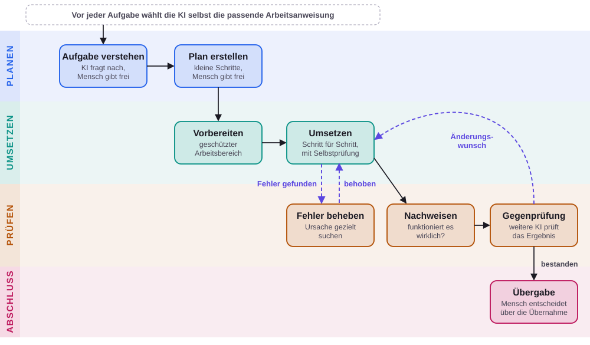

# Software mit KI entwickeln – aber mit klarer Arbeitsweise

**Kurzbeschreibung**

> Dieses Papier erklärt, wie wir Software mit Unterstützung von KI entwickeln. Die KI kann heute Software schreiben, braucht dafür aber klare Vorgaben, sonst legt sie einfach los und meldet „fertig", auch wenn es noch nicht stimmt. Deshalb setzen wir auf zwei Dinge: ein Werkzeug namens OpenCode, das die KI steuert und ihr erlaubt, tatsächlich zu arbeiten, und eine feste Methodik, die vorgibt, wie gearbeitet wird: erst verstehen, dann planen, dann umsetzen, dann prüfen und zum Schluss übergeben. An den wichtigen Punkten, nämlich bei der Freigabe des Verständnisses, des Plans und der Übernahme, entscheiden Menschen, nicht die KI. Dazwischen arbeitet die KI schnell und selbstständig, ihre Ergebnisse werden von weiteren, unabhängigen Prüfungen kontrolliert, und „fertig" gilt erst, wenn die Funktion nachgewiesen ist. Das Papier erklärt das ohne Fachbegriffe und mit einem Bauprojekt als Vergleich; ein Diagramm zeigt den Ablauf auf einen Blick.

| | |
|---|---|
| **Stand** | 05.10.2026 |

---

## Das Wichtigste in Kürze

Wir lassen KI-Assistenten Software entwickeln. Damit das verlässlich funktioniert und nicht dem Zufall überlassen bleibt, setzen wir auf zwei Dinge:

1. **Ein Werkzeug**, das die KI steuert und ihr erlaubt, tatsächlich zu arbeiten. Wir nutzen dafür **OpenCode**.
2. **Eine feste Methodik**, die vorgibt, in welcher Reihenfolge gearbeitet wird, wann Menschen entscheiden und wie geprüft wird.

Die KI arbeitet schnell und selbstständig. Die Menschen behalten die Kontrolle an den Stellen, an denen es darauf ankommt.

---

## 1. Worum es geht

KI-Assistenten können heute Texte verstehen und schreiben, und sie können auch Software entwickeln. Das Problem: Ohne klare Vorgaben legen sie sofort los. Sie fragen nicht nach, ob sie die Aufgabe richtig verstanden haben. Sie prüfen ihre eigene Arbeit nicht gründlich. Und sie melden „fertig", auch wenn es noch nicht stimmt.

Das ist, als würde man einem sehr schnellen Handwerker sagen „Bau mir ein Haus" und ihn ohne Bauplan, ohne Rückfragen und ohne Abnahme arbeiten lassen. Das Ergebnis kann gut sein, es kann aber auch teuer werden.

Unser Ansatz sorgt dafür, dass die KI wie ein gut geführtes Bauprojekt arbeitet.

---

## 2. Die Bausteine in einfachen Worten

Zur Veranschaulichung vergleichen wir es mit einem Bauprojekt:

| Baustein | Was es ist | Vergleich Bauprojekt |
|---|---|---|
| **KI-Modell** | Das „Gehirn": ein Programm, das Sprache versteht und schreibt (ähnlich wie ChatGPT). Es kann denken und formulieren, aber von allein nichts anfassen. | Ein sehr erfahrener Fachmann, der aber nur beraten kann |
| **KI-Agent** | Eine „digitale Fachkraft": das KI-Modell, das Aufgaben selbstständig Schritt für Schritt erledigt. | Der Handwerker, der tatsächlich arbeitet |
| **Werkzeug (OpenCode)** | Der „Arbeitsplatz", der dem KI-Modell Hände gibt und mehrere Agenten koordiniert. | Die Baustelle samt Werkzeug und Bauleitung |
| **Methodik** | Das „Handbuch", das festlegt, wie gearbeitet wird. | Der Ablaufplan des Bauprojekts mit Abnahmen |

---

## 3. Unser Werkzeug: OpenCode

Ein KI-Modell allein kann nur Texte ausgeben. Damit es wirklich arbeiten kann, braucht es ein Werkzeug, das ihm Möglichkeiten gibt und es lenkt. Ein solches Werkzeug nennt man auch **Harness** (englisch für „Geschirr", also etwas, das eine Kraft einspannt und in die richtige Richtung führt).

**OpenCode** ist unser Harness. Es erfüllt drei Aufgaben:

- **Es verbindet**: Es nutzt das KI-Modell als „Gehirn" und gibt ihm Zugriff auf das, was es für die Arbeit braucht.
- **Es steuert**: Es startet die KI-Agenten, verteilt die Aufgaben und achtet darauf, dass der vorgegebene Ablauf eingehalten wird.
- **Es macht sichtbar**: Wir sehen jederzeit, was die Agenten tun, und können eingreifen.

Das Werkzeug allein sagt aber noch nicht, *wie* gearbeitet werden soll. Dafür gibt es die Methodik.

---

## 4. Unsere Methodik: erst verstehen, dann planen, dann bauen, dann prüfen

Unsere Methodik ist ein ausgearbeitetes Vorgehen für die KI-gestützte Softwareentwicklung. Sie verhindert das „einfach mal loslegen" und ersetzt es durch einen klaren Ablauf mit festen Kontrollpunkten. Der Ablauf besteht aus fünf Schritten:

| Schritt | Was passiert | Wer entscheidet |
|---|---|---|
| **1. Verstehen** | Die KI fragt zuerst nach, was wirklich gebraucht wird, und fasst das Verstandene schriftlich zusammen. Erst wenn dieses Verständnis stimmt, geht es weiter. | **Mensch gibt frei** |
| **2. Planen** | Aus dem Verständnis entsteht ein ausführlicher Arbeitsplan in kleinen, überschaubaren Schritten. Er ist so klar geschrieben, dass ihn auch jemand ohne Vorwissen umsetzen könnte. | **Mensch gibt frei** |
| **3. Umsetzen** | Die KI-Agenten arbeiten den Plan Schritt für Schritt ab, oft mehrere Stunden selbstständig. Zu jedem Schritt wird zuerst festgelegt, woran man erkennt, dass er richtig gelöst ist. | KI, im Rahmen des Plans |
| **4. Prüfen** | Nach der Arbeit prüfen weitere, unabhängige Agenten das Ergebnis. Auftretende Fehler werden systematisch auf ihre Ursache untersucht und behoben. Als „fertig" gilt etwas erst, wenn es nachweislich funktioniert. | KI prüft, **Mensch kann eingreifen** |
| **5. Abschließen** | Das Ergebnis wird zusammengeführt und übergeben. Ob und wie es übernommen wird, entscheidet ein Mensch. | **Mensch entscheidet** |

Zwei Grundsätze ziehen sich durch alle Schritte:

- **Erst planen, dann bauen.** Es wird nichts gebaut, bevor die Aufgabe verstanden und der Plan freigegeben ist.
- **Nachweis statt Behauptung.** „Fertig" ist kein Gefühl, sondern etwas, das belegt werden muss.

Das Vorgehen läuft nicht als Empfehlung ab: Die KI prüft vor jeder Aufgabe selbst, welche Arbeitsanweisung gerade passt, und hält sie ein. Niemand muss das von Hand anstoßen.

### Der Ablauf auf einen Blick

Die vier Farben stehen für die vier Phasen. Die **violetten gestrichelten Pfeile** zeigen Wiederholungen: Wird ein Fehler gefunden oder wünscht die Gegenprüfung eine Änderung, geht es so lange zurück an die Arbeit, bis das Ergebnis stimmt. Erst dann folgt die Übergabe.

---

## 5. Was uns das bringt

- **Kontrolle**: An den wichtigen Punkten (Verständnis, Plan, Übernahme) entscheiden Menschen, nicht die KI.
- **Nachvollziehbarkeit**: Verständnis und Plan liegen schriftlich vor. Man kann später erkennen, was warum gebaut wurde.
- **Qualität**: Mehrere unabhängige Prüfungen und das Prinzip „Nachweis statt Behauptung" verringern das Risiko von Fehlern.
- **Weniger Überraschungen**: Weil vor dem Bauen geklärt wird, was gebaut werden soll, sinkt die Gefahr, dass am Ende etwas Falsches fertig ist.
- **Flexibilität**: Die Methodik ist unabhängig von einem einzelnen Werkzeug und läuft mit verschiedenen Systemen.
