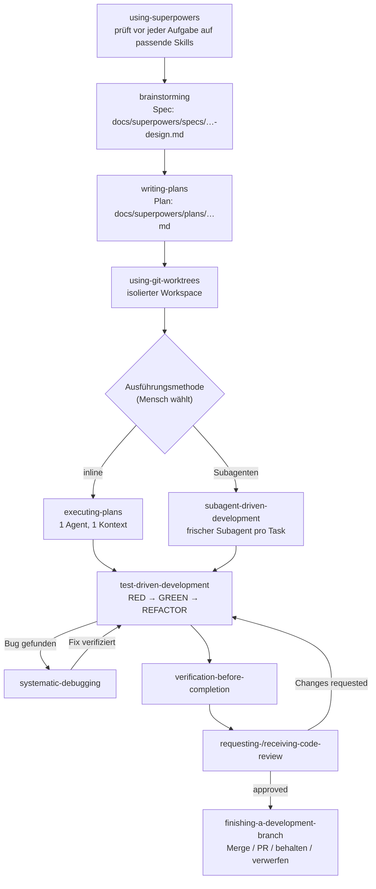

# Superpowers – Technisches Konzept

| | |
|---|---|
| **Gegenstand** | Superpowers (Skill-Pack und Methodik für Coding-Agenten) |
| **Zielgruppe** | Dev-Team, Product Management, Product Owner, Testmanagement |
| **Stand** | 2026-10-05 |
| **Quellen** | Offizielles README und `skills/*/SKILL.md` im Repository [obra/superpowers](https://github.com/obra/superpowers) (Branch `main`) |
| **Begleitmaterial** | Präsentation „Superpowers Playbook" |
| **Erstellt** | Generated by Claude Code |

---

## 1. Zweck und Einordnung

Superpowers beschreibt sich selbst als *„a complete software development methodology for your coding agents"*, aufgebaut auf einem Satz zusammensetzbarer **Skills** und Start-Anweisungen, die sicherstellen, dass der Agent diese Skills auch nutzt.

Das Problem, das adressiert wird: Ein Coding-Agent ohne festen Prozess springt direkt in den Code. Anforderungen werden nicht hinterfragt, Tests entstehen nachträglich, „fertig" ist eine Behauptung statt eines Nachweises, und Review und Abschluss laufen ad hoc.

Superpowers ersetzt das durch einen **expliziten, wiederholbaren Ablauf** mit Freigabe-Punkten (Design, Plan), eingebauten Qualitätsschleifen (TDD, Debugging, Review) und Evidenz vor Fertigmeldung.

**Einordnung:** Das Projekt heißt schlicht „Superpowers". `subagent-driven-development` ist nicht der Name der Gesamtmethodik, sondern der Name einer der beiden Ausführungsstrategien (siehe Kapitel 5).

---

## 2. Grundprinzipien

Laut README (Abschnitt „Philosophy"):

| Prinzip | Bedeutung |
|---|---|
| **Test-Driven Development** | Tests zuerst, immer (RED → GREEN → REFACTOR) |
| **Systematic over ad-hoc** | Prozess statt Raten |
| **Complexity reduction** | Einfachheit als primäres Ziel (YAGNI, DRY) |
| **Evidence over claims** | Verifizieren, bevor Erfolg gemeldet wird |

---

## 3. Architektur

### 3.1 Skills als Bausteine

Ein **Skill** ist eine in sich geschlossene Anleitung (`skills/<name>/SKILL.md`) für eine bestimmte Situation, z. B. Design klären, Plan schreiben, Bug analysieren. Skills sind **zusammensetzbar**: Ein Skill kann am Ende auf den nächsten verweisen (z. B. `brainstorming` → `writing-plans`).

### 3.2 Automatische Aktivierung

Der Einstiegs-Skill `using-superpowers` sorgt dafür, dass der Agent **vor jeder Aufgabe prüft, ob ein Skill zutrifft**. Das README formuliert: *Mandatory workflows, not suggestions.* Niemand muss Skills manuell auswählen; der Agent „hat" Superpowers einfach.

### 3.3 Plattformen

Das README führt Installationswege für u. a. Claude Code, Cursor, Codex (App und CLI), Gemini CLI, GitHub Copilot CLI, Devin CLI, OpenCode, Antigravity, Factory Droid, Kimi Code, Qwen Code, Pi, Hermes Agent, Grok Build CLI und Muse auf. Die Installation erfolgt **pro Plattform separat**.

Beispiel Claude Code (offizieller Marktplatz):

```bash
/plugin install superpowers@claude-plugins-official
```

---

## 4. Workflow

### 4.1 Phasen im Überblick

| Phase | Schritt | Skill | Rolle(n) im Fokus |
|---|---|---|---|
| **Planen** | Anforderungen klären, Design freigeben | `brainstorming` | PM · PO · Dev |
| **Planen** | Implementierungsplan schreiben | `writing-plans` | PM · PO · Dev |
| **Umsetzen** | Isolierten Workspace anlegen | `using-git-worktrees` | Dev |
| **Umsetzen** | Plan ausführen | `executing-plans` **oder** `subagent-driven-development` | Dev |
| **Umsetzen** | Testgetrieben arbeiten (pro Task) | `test-driven-development` | Dev · Test |
| **Qualität** | Fehler systematisch analysieren (bei Bedarf) | `systematic-debugging` | Dev · Test |
| **Qualität** | Wirkung nachweisen | `verification-before-completion` | Test · PM |
| **Qualität** | Review anfragen / Feedback einarbeiten | `requesting-code-review` / `receiving-code-review` | Dev |
| **Abschluss** | Merge/PR-Entscheidung und Aufräumen | `finishing-a-development-branch` | Dev · PM |

### 4.2 Ablaufdiagramm



### 4.3 Wichtiger Hinweis zur Reihenfolge der Worktrees

Die vereinfachte Liste „The Basic Workflow" im README nennt `using-git-worktrees` als **Schritt 2**, also direkt nach der Design-Freigabe und vor `writing-plans`. Die Skill-Definitionen selbst stellen es anders dar:

- `brainstorming` nennt als **einzigen** Folgeschritt `writing-plans` (*„writing-plans is the next step"*).
- `using-git-worktrees` beschreibt sich als anzuwenden *„before executing implementation plans"*.
- `writing-plans` verweist darauf, dass ein Worktree *„at execution time"* angelegt wird.

Dieses Dokument und die Präsentation folgen den **Skill-Definitionen** (Plan zuerst, Worktree unmittelbar vor der Umsetzung). Das README ist an dieser Stelle eine Vereinfachung. Bei Abweichungen im Projektalltag gilt, was die installierte Skill-Version tatsächlich vorgibt.

---

## 5. Ausführungsstrategien

Nach dem Plan wird entschieden, wie umgesetzt wird (`writing-plans` fragt, falls nicht vorgegeben). Beide Wege sind **sequenziell**, laufen ohne Rückfrage zwischen den Tasks und teilen sich dieselbe Fortschritts-Datei.

| | `executing-plans` | `subagent-driven-development` |
|---|---|---|
| **Prinzip** | Ein Agent, ein Kontext, alle Tasks inline | Frischer Implementer-Subagent pro Task |
| **TDD** | pro Task, entlang der Plan-Schritte (bereits in RED-GREEN-Reihenfolge) | pro Task |
| **Review** | **einmal am Ende** über den ganzen Branch, durch einen frischen Reviewer auf dem stärksten verfügbaren Modell | **nach jedem Task** (Spec-Konformität und Code-Qualität) **plus** Abschluss-Review über den ganzen Branch |
| **Fix-Schleife** | – | Runden 1–3 mit demselben Implementer, ab Runde 4 Eskalation an einen stärkeren, frischen Implementer; danach jeweils begrenztes Re-Review |
| **Parallelität** | nein | **nein** – Implementierungs-Subagenten werden ausdrücklich nie parallel dispatcht (Konfliktgefahr) |
| **Charakter laut README** | günstigste Variante | gründlichste Variante |
| **Abbruchbedingungen** | nur: irreversible Operationen, sicherheitsrelevante Aktionen, externe Seiteneffekte, grundlegend defekter Plan | analog |

### Fortschritts-Ledger (geteilt)

Beide Strategien nutzen **denselben Workspace und dasselbe Ledger**, sodass ein Plan mitten im Lauf den Executor wechseln kann:

```text
<repo-root>/.superpowers/sdd/<plan-basename>/progress.md
```

Das Verzeichnis ist git-ignoriert. Die erste Zeile identifiziert den Plan; der ursprüngliche Plan wird **nicht** verändert. Nach Abschluss wird der Workspace gelöscht.

### `dispatching-parallel-agents` ist kein dritter Weg

Dieser Skill ist ein **eigenständiges Muster** für mehrere wirklich unabhängige Teilprobleme (z. B. mehrere getrennte Bugs):

- **Eignung:** unterschiedliche Subsysteme oder Testdateien, kein gemeinsamer Zustand, jedes Problem für sich verständlich.
- **Ausschluss:** Agenten, die sich gegenseitig beeinflussen würden (überlappender Code).
- **Zusammenführung:** Zusammenfassungen sichten → Konflikte prüfen (identischer Code editiert?) → vollständige Testausführung → Stichprobe auf systematische Fehler.

Er ersetzt **nicht** die sequenzielle Abarbeitung abhängiger Tasks eines Plans.

---

## 6. Artefakte und Dateipfade

| Schritt | Erzeugt | Pfad | Hinweis |
|---|---|---|---|
| `brainstorming` | Spec (Design-Dokument) | `docs/superpowers/specs/YYYY-MM-DD-<topic>-design.md` | nur im „architectural"-Pfad (siehe 7.1); Projektvorgaben überschreiben den Standardpfad |
| `writing-plans` | Implementierungsplan | `docs/superpowers/plans/YYYY-MM-DD-<feature-name>.md` | Projektvorgaben überschreiben den Standardpfad |
| `using-git-worktrees` | isolierter Arbeitsbereich | Worktree-Verzeichnis | kein Dokument; Skill erkennt bestehende Isolation zuerst und nutzt bevorzugt plattformeigene Tools |
| `executing-plans` / `subagent-driven-development` | geteiltes Ledger | `.superpowers/sdd/<plan-basename>/progress.md` | git-ignoriert, nach Abschluss gelöscht |
| `requesting-/receiving-code-review`, `systematic-debugging`, `verification-before-completion` | **kein eigenes Artefakt** | – | Arbeit im Agent-Kontext |
| `finishing-a-development-branch` | **kein Repo-File** | – | Ergebnis ist ein Git-Merge, ein Push mit Pull Request oder ein bewusstes Behalten/Verwerfen; räumt Worktree auf |
| `diagnosing-superpowers` | Fallakte und optionales Bug-Report-Bundle | `~/.superpowers/diagnosing-superpowers/<session-id>/` | Bundle nur auf ausdrückliche Anfrage, nach Schwärzung und Freigabe durch den Menschen |

**Konsequenz für Nachvollziehbarkeit:** Dauerhaft im Repository bleiben Spec und Plan. Der Ausführungsverlauf (Ledger) ist bewusst flüchtig. Review- und Verifikationsergebnisse entstehen im Sitzungsverlauf, nicht als Datei.

---

## 7. Qualitätsmechanismen

### 7.1 Design-Phase (`brainstorming`)

- **Hard Gate:** Vor jeder Implementierungshandlung ist eine ausdrückliche Freigabe nötig. Eine Spec-Freigabe erlaubt nur den Aufruf von `writing-plans`.
- **Klassifikation des Aufwands:** *spike* (Machbarkeitsfrage, endet mit Empfehlung und Wegwerf-Code), *bounded* (klar umrissene Änderung, kein Plan-Dokument nötig) oder *architectural* (neue Systeme/Umbau, schriftliche Spec und anschließend `writing-plans`).
- **Gemeinsames Verständnis:** Der Agent fasst Absicht, Randbedingungen und Erfolgskriterien zusammen, trennt Gesagtes von Annahmen und lädt zur Korrektur ein.

### 7.2 Plan-Phase (`writing-plans`)

- Tasks von rund **2–5 Minuten** mit exakten Dateipfaden, vollständigem Code und Verifikationsschritten.
- Der Plan ist so geschrieben, dass ihn jemand ohne Projektkontext umsetzen kann; Grundsätze: DRY, YAGNI, TDD, häufige Commits.
- Task-Zuschnitt: kleinste Einheit mit eigenem Testzyklus, die ein frischer Reviewer sinnvoll ablehnen oder freigeben kann.

### 7.3 Umsetzung (`test-driven-development`)

RED-GREEN-REFACTOR: fehlschlagenden Test schreiben, Fehlschlag beobachten, minimalen Code schreiben, Erfolg beobachten, committen. Code, der vor den Tests entstand, wird verworfen (laut README).

### 7.4 Wiederholschleifen

| Schleife | Auslöser | Rücksprung |
|---|---|---|
| **TDD-Zyklus** | jeder Task | innerhalb des Tasks bis grün und aufgeräumt |
| **Bug-Schleife** | Fehler während Umsetzung/Verifikation | `systematic-debugging` (4-Phasen-Ursachenanalyse, mit Techniken *root-cause-tracing*, *defense-in-depth*, *condition-based-waiting*), danach zurück in die Umsetzung |
| **Review-Schleife** | Findings mit Schweregrad (kritische blockieren den Fortschritt) | Fix-Runde und Re-Review (bei `subagent-driven-development` mit Eskalationsstufen) |

### 7.5 Evidenz vor Fertigmeldung

`verification-before-completion` steht für das Prinzip *Evidence over claims*: Ein Fix gilt erst als erledigt, wenn seine Wirkung nachgewiesen ist.

---

## 8. Skill-Katalog

| Skill | Kategorie | Zweck |
|---|---|---|
| `using-superpowers` | Meta | Einstiegspunkt; stellt sicher, dass vor jeder Aufgabe auf passende Skills geprüft wird |
| `writing-skills` | Meta | Neue Skills nach Best Practices schreiben (inkl. Testmethodik) |
| `brainstorming` | Zusammenarbeit | Sokratische Design-Klärung; schreibt die Spec |
| `writing-plans` | Zusammenarbeit | Detaillierter Plan aus kleinen Tasks |
| `using-git-worktrees` | Zusammenarbeit | Isolierter Workspace auf neuem Branch, Projekt-Setup, sauberer Test-Ausgangszustand |
| `executing-plans` | Zusammenarbeit | Plan inline in einem Kontext abarbeiten, ein Abschluss-Review |
| `subagent-driven-development` | Zusammenarbeit | Frischer Subagent pro Task mit zweistufigem Review (Spec-Konformität, dann Code-Qualität) |
| `dispatching-parallel-agents` | Zusammenarbeit | Gleichzeitige Bearbeitung unabhängiger Teilprobleme durch mehrere Agenten |
| `requesting-code-review` | Zusammenarbeit | Checkliste vor dem Review; Review gegen den Plan, Findings nach Schweregrad |
| `receiving-code-review` | Zusammenarbeit | Strukturierter Umgang mit Feedback |
| `finishing-a-development-branch` | Zusammenarbeit | Tests prüfen, Optionen (Merge, PR, behalten, verwerfen), Worktree aufräumen |
| `test-driven-development` | Testen | RED-GREEN-REFACTOR (inkl. Anti-Pattern-Referenz) |
| `systematic-debugging` | Debugging | 4-Phasen-Ursachenanalyse |
| `verification-before-completion` | Debugging | Sicherstellen, dass es wirklich behoben ist |
| `diagnosing-superpowers` | Debugging | Sitzung auswerten, wenn ein Skill nicht wie erwartet gegriffen hat |

---

## 9. Perspektive der Rollen

*Hinweis: Die folgende Zuordnung ist eine Einordnung für dieses Konzept, keine Aussage des Projekts selbst.*

| Rolle | Berührungspunkte | Nutzen |
|---|---|---|
| **Dev-Team** | gesamter Ablauf, v. a. Plan, TDD, Review | klare 2–5-Minuten-Tasks, eingebaute Review-Gates, reproduzierbares Debugging |
| **Product Manager** | Design-Freigabe, Plan, Abschluss-Entscheidung | Checkpoints, bevor Entwicklungszeit investiert wird; kein Merge ohne nachgewiesene Qualität |
| **Product Owner** | `brainstorming`, Spec, Plan | Anforderungen werden vor der Umsetzung hinterfragt; Spec und Plan sind lesbar und prüfbar, weniger Scope-Drift |
| **Testmanagement** | TDD, Debugging, Verifikation | Test-first als Standard; „fertig" heißt verifiziert; Fehleranalyse folgt einem festen Schema |

---

## 10. Betrieb und Fehlerdiagnose

- **Wenn eine Sitzung sich unerwartet verhält** (Skill feuert unpassend, bleibt stumm, Agent ignoriert den Plan, wiederholt Arbeit oder verbraucht auffällig viele Tokens): Den Agenten bitten, *„figure out what went wrong with superpowers in this session"* zu klären. Das aktiviert `diagnosing-superpowers`, das das Sitzungsprotokoll liest und mit Zeilenbelegen berichtet.
- **Frühere Sitzung:** die Sitzungs-ID nennen.
- **Bug-Report:** Auf Wunsch wird ein geschwärztes Bundle gepackt; es entsteht nie ungefragt.

---

## 11. Grenzen und offene Punkte

- **Quellenlage:** Aussagen beruhen auf README und Skill-Dateien des Branches `main` zum Stand dieses Dokuments. Skills entwickeln sich weiter; konkrete Details (z. B. Eskalationsrunden, Pfade) sind gegen die installierte Version zu prüfen.
- **README vs. Skill-Definitionen:** Siehe 4.3 zur Position von `using-git-worktrees`.
- **Flüchtige Artefakte:** Das Ausführungs-Ledger wird nach Abschluss gelöscht; wer Auditierbarkeit des Umsetzungsverlaufs braucht, muss sie anderweitig sicherstellen (z. B. über Commits und PR-Beschreibungen).
- **Nicht untersucht:** Details zu `verification-before-completion`, `receiving-code-review` und `writing-skills` über die README-Beschreibung hinaus; Kosten-/Token-Vergleich der beiden Ausführungsstrategien.
- **Rollen-Zuordnung:** Kapitel 9 ist eine Interpretation und sollte mit dem Team abgestimmt werden.

---

## 12. Quellen

- README: <https://github.com/obra/superpowers> (Abschnitte *How it works*, *The Basic Workflow*, *What's Inside*, *Philosophy*, *When Something Goes Wrong*)
- Skill-Definitionen: `skills/<name>/SKILL.md` im selben Repository
- Ankündigung des Projekts (vom README verlinkt): <https://blog.fsck.com/2025/10/09/superpowers/>
